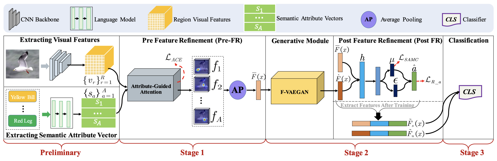

# ViFR [[arXiv]]()


This repository contains the training codes for the paper  "***ViFR: Visual Feature Refinement for Zero-Shot Learning***" submitted to T-PAMI. 




## Running Environment
The implementation of **ViFR** mainly based on [PyTorch](https://pytorch.org/). All of our experiments run and test in Python 3.8.8. Moreover, we use [Weights & Biases](https://wandb.ai/site) (W&B) to keep track and organize the results of experiments. Before running our codes, you should follow the [online documentation](https://docs.wandb.ai/quickstart) of W&B to quickstart. You can sign up an online account to track experiments or create a [local server](https://hub.docker.com/r/wandb/local) using docker (recommend).

To install all required dependencies:
```
$ pip install -r requirements.txt
```


## Download Dataset 

We trained the model on three popular ZSL benchmarks: [CUB](http://www.vision.caltech.edu/visipedia/CUB-200-2011.html), [SUN](http://cs.brown.edu/~gmpatter/sunattributes.html) and [AWA2](http://cvml.ist.ac.at/AwA2/) following the data split of [xlsa17](http://datasets.d2.mpi-inf.mpg.de/xian/xlsa17.zip). In order to train the **ViFR**, you should firstly download these datasets as well as the xlsa17. Then decompress and organize them as follows: 
```
.
├── data
│   ├── CUB/CUB_200_2011/...
│   ├── SUN/images/...
│   ├── AWA2/Animals_with_Attributes2/...
│   └── xlsa17/data/...
└── ···
```


## Visual Features Preprocessing

In this step, you should run following commond to extract visual features of three datasets, for example:

```
$ python preprocessing.py --dataset CUB --compression --device cuda:0
```
If your storage is absolutely enough, you could remove the option of `--compression`. This will occupy 56GB space for AWA2, 22GB for SUN and 18GB for CUB, but can significantly reduce the data loading time when training models.
In addition, extracting and loading visual features will use large memory (e.g., nearly 128GB for AWA2. You may need to add the space of your swap files/partitions (or virtual memory) if memory is not enough. Modifying the codes to implement visual feature extraction in the training loop is an alternative way. 

## Training ViFR from Scratch
We provide our parameters setting of conventional ZSL (CZSL) and generalized ZSL (GZSL) tasks in three datasets. You can run following commands to train the **ViFR** from scratch:

```
$ python train_cub.py   # CUB
$ python train_sun.py   # SUN
$ python train_awa2.py  # AWA2
```
**Note**: For SUN and AWA2, the parameters setting is different for CZSL and GZSL. Please load the corresponding setting when aiming at CZSL task.

## Results

We also provide trained models ([Google Drive]()) on three datasets. You can download these saved models and validate the results of our paper. Please refer the [test branch]() for testing codes and detail usage.
Results of our released models using various evaluation protocols on three datasets, both in the CZSL and GZSL settings.
**The input size of ResNet-101 is 224x224:**
| Dataset | Acc(CZSL) | U(GZSL) | S(GZSL) | H(GZSL) |
| :-----: | :-----: | :-----: | :-----: | :-----: |
| CUB | 69.1 | 57.8 | 62.7 | 60.1 |
| SUN | 65.6 | 48.8 | 35.2 | 40.9 |
| AWA2 | 73.7 | 58.4 | 81.4 | 68.0 |

**The input size of ResNet-101 is 448x448:**
| Dataset | Acc(CZSL) | U(GZSL) | S(GZSL) | H(GZSL) |
| :-----: | :-----: | :-----: | :-----: | :-----: |
| CUB | 74.5 | 63.9 | 72.0 | 67.7 |
| SUN | 69.2 | 51.3 | 40.0 | 44.7 |
| AWA2 | 77.8 | 68.2 | 78.9 | 73.2 |

**Note**:  The training of our models and all of above results are run on a server with an AMD Ryzen 7 5800X CPU, 128GB memory and a NVIDIA RTX A6000 GPU (48GB).
<!-- 
## Citation
If this work is helpful for you, please cite our paper.

```
@InProceedings{Chen2021TransZero,
    author    = {Chen, Shiming and Hong, Ziming and Liu, Yang and Xie, Guo-Sen and Sun, Baigui and Li, Hao and Peng, Qinmu and Lu, Ke and You, Xinge},
    title     = {TransZero: Attribute-guided Transformer for Zero-Shot Learning},
    booktitle = {Proceedings of the Thirty-Sixth AAAI Conference on Artificial Intelligence (AAAI)},
    year      = {2022}
}
``` -->

## References
Parts of our codes based on:
* [hbdat/cvpr20_DAZLE](https://github.com/hbdat/cvpr20_DAZLE)
* [shiming-chen/FREE](https://github.com/shiming-chen/FREE)
* [akshitac8/tfvaegan](https://github.com/akshitac8/tfvaegan)

## Contact
If you have any questions about codes, please don't hesitate to contact us by gchenshiming@gmail.com or hoongzm@gmail.com.
